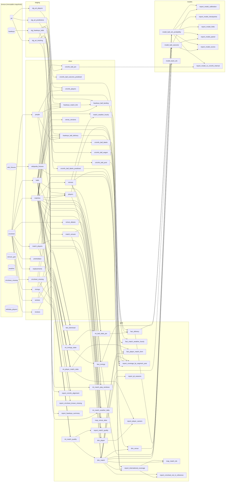

# Lineage

Generated by `cricket docs` from the `sources` and `upstream` of every contract. Restricted sources (never exported) are drawn with dashed borders.

```mermaid
flowchart LR
  subgraph bronze["bronze (immutable snapshots)"]
    src_ari[(ari)]
    src_cricsheet[(cricsheet)]
    src_cricsheet_missing[(cricsheet_missing)]
    src_hawkeye[(hawkeye)]
    src_venues_geo[(venues_geo)]
    src_weather[(weather)]
    src_wiki_fixtures[(wiki_fixtures)]
    src_wikidata_players[(wikidata_players)]
  end
  subgraph staging["staging"]
    stg_ari_players[stg_ari_players]
    stg_ari_predictions[stg_ari_predictions]
    stg_ari_tracking[stg_ari_tracking]
    stg_hawkeye_balls[stg_hawkeye_balls]
  end
  subgraph silver["silver"]
    balls[balls]
    cricinfo_ball_labels[cricinfo_ball_labels]
    cricinfo_ball_labels_predicted[cricinfo_ball_labels_predicted]
    cricinfo_ball_outcome_predicted[cricinfo_ball_outcome_predicted]
    cricinfo_ball_post[cricinfo_ball_post]
    cricinfo_ball_pre[cricinfo_ball_pre]
    cricinfo_ball_wagon[cricinfo_ball_wagon]
    cricinfo_players[cricinfo_players]
    cricsheet_missing[cricsheet_missing]
    hawkeye_ball_delivery[hawkeye_ball_delivery]
    hawkeye_ball_landing[hawkeye_ball_landing]
    hawkeye_match_link[hawkeye_match_link]
    innings[innings]
    match_players[match_players]
    match_venues[match_venues]
    match_weather_hourly[match_weather_hourly]
    matches[matches]
    people[people]
    players[players]
    powerplays[powerplays]
    replacements[replacements]
    reviews[reviews]
    venue_aliases[venue_aliases]
    venue_versions[venue_versions]
    venues[venues]
    wickets[wickets]
    wikipedia_fixtures[wikipedia_fixtures]
  end
  subgraph gold["gold"]
    dim_match[dim_match]
    dim_player[dim_player]
    dim_venue[dim_venue]
    fact_delivery[fact_delivery]
    fact_dismissal[fact_dismissal]
    fact_innings[fact_innings]
    fact_match_weather_hourly[fact_match_weather_hourly]
    fact_player_match_form[fact_player_match_form]
    int_ball_state_pre[int_ball_state_pre]
    int_innings_state[int_innings_state]
    int_match_play_windows[int_match_play_windows]
    int_match_quality[int_match_quality]
    int_match_weather_daily[int_match_weather_daily]
    int_player_match_stats[int_player_match_stats]
    map_match_ids[map_match_ids]
    map_venue_alias[map_venue_alias]
    report_coverage_by_segment_year[report_coverage_by_segment_year]
    report_cricinfo_alignment[report_cricinfo_alignment]
    report_cricsheet_known_missing[report_cricsheet_known_missing]
    report_cricsheet_not_in_reference[report_cricsheet_not_in_reference]
    report_hawkeye_summary[report_hawkeye_summary]
    report_international_coverage[report_international_coverage]
    report_ipl_seasons[report_ipl_seasons]
    report_match_quality[report_match_quality]
    report_player_careers[report_player_careers]
  end
  subgraph models["models"]
    model_ball_outcome[model_ball_outcome]
    model_ball_win_probability[model_ball_win_probability]
    model_team_elo[model_team_elo]
    report_model_calibration[report_model_calibration]
    report_model_checkpoints[report_model_checkpoints]
    report_model_folds[report_model_folds]
    report_model_paired[report_model_paired]
    report_model_scores[report_model_scores]
    report_model_vs_cricinfo_internal[report_model_vs_cricinfo_internal]
  end
  src_ari --> stg_ari_players
  src_ari --> stg_ari_predictions
  src_ari --> stg_ari_tracking
  src_hawkeye --> stg_hawkeye_balls
  src_cricsheet --> balls
  stg_ari_tracking --> cricinfo_ball_labels
  stg_ari_predictions --> cricinfo_ball_labels_predicted
  stg_ari_predictions --> cricinfo_ball_outcome_predicted
  stg_ari_tracking --> cricinfo_ball_post
  balls --> cricinfo_ball_pre
  stg_ari_tracking --> cricinfo_ball_pre
  stg_ari_tracking --> cricinfo_ball_wagon
  stg_ari_players --> cricinfo_players
  people --> cricinfo_players
  src_cricsheet_missing --> cricsheet_missing
  stg_hawkeye_balls --> hawkeye_ball_delivery
  balls --> hawkeye_ball_delivery
  matches --> hawkeye_ball_delivery
  people --> hawkeye_ball_delivery
  stg_hawkeye_balls --> hawkeye_ball_landing
  hawkeye_match_link --> hawkeye_ball_landing
  balls --> hawkeye_ball_landing
  stg_hawkeye_balls --> hawkeye_match_link
  balls --> hawkeye_match_link
  matches --> hawkeye_match_link
  people --> hawkeye_match_link
  src_cricsheet --> innings
  src_cricsheet --> match_players
  matches --> match_venues
  matches --> match_weather_hourly
  venues --> match_weather_hourly
  src_cricsheet --> matches
  src_cricsheet --> people
  people --> players
  match_players --> players
  matches --> players
  src_cricsheet --> powerplays
  src_cricsheet --> replacements
  src_cricsheet --> reviews
  src_cricsheet --> venue_aliases
  matches --> venue_versions
  matches --> venues
  src_cricsheet --> wickets
  src_wiki_fixtures --> wikipedia_fixtures
  matches --> dim_match
  int_match_quality --> dim_match
  match_venues --> dim_match
  players --> dim_player
  match_players --> dim_player
  matches --> dim_player
  venues --> dim_venue
  dim_match --> dim_venue
  balls --> fact_delivery
  matches --> fact_delivery
  int_ball_state_pre --> fact_delivery
  wickets --> fact_dismissal
  matches --> fact_dismissal
  innings --> fact_innings
  matches --> fact_innings
  int_innings_state --> fact_innings
  balls --> fact_innings
  match_weather_hourly --> fact_match_weather_hourly
  matches --> fact_match_weather_hourly
  int_player_match_stats --> fact_player_match_form
  players --> fact_player_match_form
  dim_match --> fact_player_match_form
  balls --> int_ball_state_pre
  int_innings_state --> int_ball_state_pre
  matches --> int_ball_state_pre
  innings --> int_innings_state
  matches --> int_innings_state
  balls --> int_innings_state
  matches --> int_match_play_windows
  venues --> int_match_play_windows
  stg_ari_tracking --> int_match_play_windows
  matches --> int_match_quality
  innings --> int_match_quality
  balls --> int_match_quality
  matches --> int_match_weather_daily
  venues --> int_match_weather_daily
  stg_ari_tracking --> int_match_weather_daily
  match_players --> int_player_match_stats
  matches --> int_player_match_stats
  balls --> int_player_match_stats
  wickets --> int_player_match_stats
  report_international_coverage --> map_match_ids
  dim_match --> map_match_ids
  venue_aliases --> map_venue_alias
  match_venues --> map_venue_alias
  dim_match --> report_coverage_by_segment_year
  balls --> report_coverage_by_segment_year
  hawkeye_ball_delivery --> report_coverage_by_segment_year
  cricinfo_ball_labels --> report_coverage_by_segment_year
  cricinfo_ball_wagon --> report_coverage_by_segment_year
  cricinfo_ball_post --> report_coverage_by_segment_year
  cricinfo_ball_labels_predicted --> report_coverage_by_segment_year
  stg_ari_tracking --> report_cricinfo_alignment
  balls --> report_cricinfo_alignment
  reviews --> report_cricinfo_alignment
  cricsheet_missing --> report_cricsheet_known_missing
  dim_match --> report_cricsheet_not_in_reference
  report_international_coverage --> report_cricsheet_not_in_reference
  stg_hawkeye_balls --> report_hawkeye_summary
  wikipedia_fixtures --> report_international_coverage
  dim_match --> report_international_coverage
  cricsheet_missing --> report_international_coverage
  dim_match --> report_ipl_seasons
  int_match_quality --> report_match_quality
  matches --> report_match_quality
  int_player_match_stats --> report_player_careers
  dim_player --> report_player_careers
  fact_delivery --> model_ball_outcome
  fact_innings --> model_ball_outcome
  dim_match --> model_ball_outcome
  fact_delivery --> model_ball_win_probability
  fact_innings --> model_ball_win_probability
  dim_match --> model_ball_win_probability
  dim_venue --> model_ball_win_probability
  dim_match --> model_team_elo
  model_ball_win_probability --> report_model_calibration
  model_ball_outcome --> report_model_calibration
  model_ball_win_probability --> report_model_checkpoints
  model_ball_win_probability --> report_model_folds
  model_ball_win_probability --> report_model_paired
  model_ball_outcome --> report_model_paired
  model_ball_win_probability --> report_model_scores
  model_ball_outcome --> report_model_scores
  model_ball_win_probability --> report_model_vs_cricinfo_internal
  cricinfo_ball_pre --> report_model_vs_cricinfo_internal
  classDef restricted stroke-dasharray: 5 5
  class src_ari,src_hawkeye restricted
```
